# Research Report: Dockerized AI Code Embedding & Indexing Tooling Stack

**Date:** June 14, 2026
**Author:** Infrastructure Architecture Research
**Status:** Research Complete — Ready for Implementation Planning
**Project:** `dockerized-code-embeding-indexing`

---

## Table of Contents

1. [Executive Summary](#1-executive-summary)
2. [Prior Art Analysis — The Example Project](#2-prior-art-analysis--the-example-project)
3. [Core Concepts & Technology Landscape](#3-core-concepts--technology-landscape)
4. [Architecture Design](#4-architecture-design)
5. [Component Deep-Dives](#5-component-deep-dives)
6. [MCP Server Ecosystem](#6-mcp-server-ecosystem)
7. [Vector Database Strategy](#7-vector-database-strategy)
8. [Embedding Models & Strategies](#8-embedding-models--strategies)
9. [Observability Layer](#9-observability-layer)
10. [File & Directory Structure Plan](#10-file--directory-structure-plan)
11. [Docker Compose Override Pattern](#11-docker-compose-override-pattern)
12. [Networking & Connectivity](#12-networking--connectivity)
13. [Volume & Persistence Strategy](#13-volume--persistence-strategy)
14. [Extensibility & Growth Path](#14-extensibility--growth-path)
15. [Implementation Plan](#15-implementation-plan)
16. [Risk Assessment](#16-risk-assessment)
17. [Glossary](#17-glossary)
18. [References](#18-references)

---

## 1. Executive Summary

This report documents the research, architecture, and implementation strategy for building a **portable, dockerized AI development tooling stack** that can be dropped into any software project to provide:

- **Codebase semantic search** — AI agents can search code by meaning, not just keywords
- **Persistent AI memory** — Context, decisions, and project knowledge survive across sessions
- **Observability** — Full OpenTelemetry traces, logs, and metrics via Aspire Dashboard
- **Vector storage** — Multiple vector database backends (Qdrant + pgvector) for different workloads
- **MCP server orchestration** — Model Context Protocol servers that expose these capabilities to any AI coding assistant (GitHub Copilot, Claude, Cursor, Windsurf, etc.)

The design is informed by a **proven, production-tested reference implementation** in the example project (`container-onramp-supplemental-api`), which successfully dockerized this exact stack. This report generalises that project-specific implementation into a **reusable, project-agnostic toolkit**.

### Key Design Principles

| Principle | Rationale |
| :--- | :--- |
| **Override-only deployment** | The toolkit lives in `dev-docker-env/` and activates via `docker-compose.override.yaml` — zero changes to the host project's `docker-compose.yaml` |
| **Ollama on host** | Embedding models are too large for container images; host-installed Ollama is accessed via `host.docker.internal:11434` |
| **On-demand MCP execution** | MCP servers are invoked via `docker exec`, not as persistent daemons — zero resource usage when idle |
| **External named volumes** | All persistent data survives `docker compose down`; only explicit `docker volume rm` deletes data |
| **Wrapper script isolation** | Each MCP server gets its own environment variables via wrapper scripts, avoiding conflicts between servers |

---

## 2. Prior Art Analysis — The Example Project

The example project (`container-onramp-supplemental-api`) is a mature Nx monorepo with a Fastify API. Its local development environment was extended with a full AI tooling stack over multiple iterations. The evolution is documented across two key directories:

### 2.1 Evolution Timeline

```mermaid
timeline
    title Example Project AI Tooling Evolution
    section Phase 1 : Host-Based Setup
        May 26, 2026 : Ollama installed on host
                     : nomic-embed-text v1.5 pulled (274 MB)
                     : qwen2.5 3b pulled (1.9 GB)
                     : Qdrant running natively at localhost 6333
                     : PostgreSQL 16 running natively
                     : pgvector extension installed
                     : mhalder/qdrant-mcp-server cloned and built
                     : better-qdrant-mcp-server installed via npm
                     : Aperio cloned and configured
                     : VS Code MCP settings configured
                     : 530 files indexed — 2753 chunks stored after Ollama chunk fix
        section Phase 2 : Dockerized Stack
            June 2026   : All tools containerized
                        : docker-compose.override.yml created
                        : Dockerfile.vector-stack — single container with 3 MCP servers
                        : Dockerfile.postgres-pgvector — PG18 plus pgvector v0.8.1
                        : qdrant-mcp-server v3.3.5+ includes upstream PR #60 fixes
                        : Wrapper scripts for env var isolation
                        : External named volumes for persistence
                        : ai-stack.sh CLI for management
                        : start.sh for one-command launch
    section Phase 3 : Validation
        June 2026   : Automated validation scripts
                    : First-time startup validated — 40 sec
                    : Persistence validated — volumes survive restart
                    : DB target switching validated
```

### 2.2 Bugs Discovered and Fixed

The example project encountered and resolved critical issues that directly inform this toolkit's design:

| Bug | Root Cause | Fix Applied | Impact on This Toolkit |
| :--- | :--- | :--- | :--- |
| Qdrant version mismatch | `@qdrant/js-client-rest` v1.18 rejects Qdrant v1.16 server | Upstream `qdrant-mcp-server` v3.3.5 includes `checkCompatibility: false` from PR #60 | Pin `@mhalder/qdrant-mcp-server` v3.3.5+; fork no longer required |
| Silent zero-indexing | Ollama returns HTTP 500 for oversized chunks; error thrown as plain object, not `Error` instance | Upstream v3.3.5 truncates input to 3800 chars before embedding; local wrapper keeps `CODE_CHUNK_SIZE=1500` as a second guard | Pin v3.3.5+ and keep conservative chunking |
| npx cache breakage | `better-qdrant-mcp-server` via npx missing `@langchain/core/documents` | Install as local npm dependency, invoke via direct `node` path | Install in Dockerfile, not via npx |
| Aperio `logger.warning()` | Node.js winston has `logger.warn()`, not `logger.warning()` | `sed -i` patch at Docker build time | Apply same sed patch in Dockerfile |

### 2.3 Architecture Patterns Extracted

The following proven patterns from the example project are carried forward:

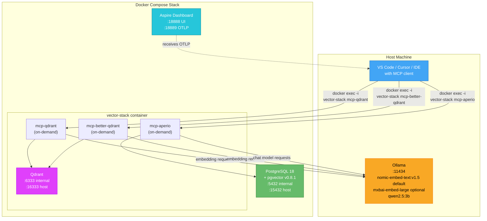

---

## 3. Core Concepts & Technology Landscape

### 3.1 What is the Model Context Protocol (MCP)?

MCP is an [open standard created by Anthropic](https://modelcontextprotocol.io) that provides a universal interface for AI assistants to connect to external data sources and tools. Think of it as "USB for AI" — a single protocol that works across all AI coding assistants.

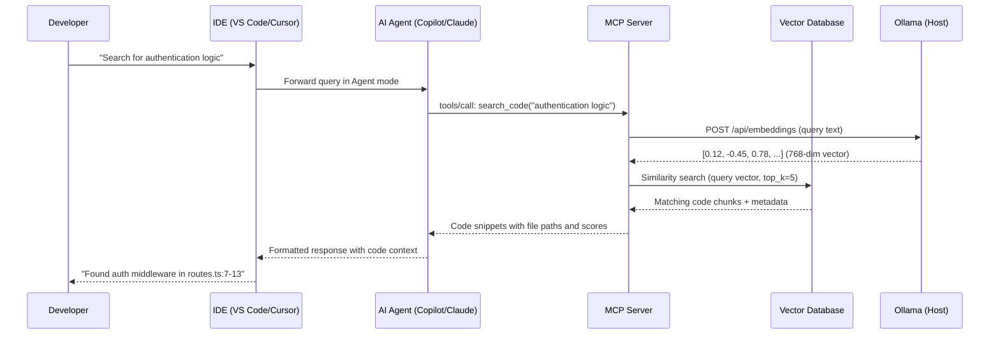

### 3.2 How AI Codebase Indexing Works

The indexing pipeline transforms source code into searchable vector embeddings:

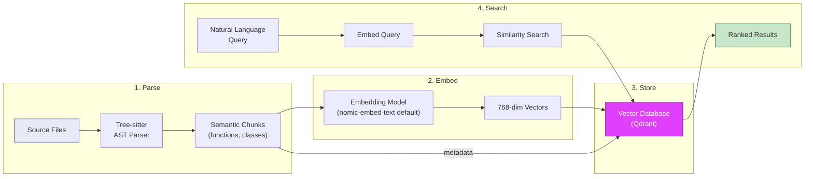

### 3.3 Why This Matters for Developers

| Problem | Without AI Indexing | With AI Indexing |
| :--- | :--- | :--- |
| Finding code | `grep`, `ripgrep`, exact keyword matching | Natural language: "how does retry logic work?" |
| Context window limits | LLM sees only open files | LLM searches entire indexed codebase |
| Session amnesia | Every conversation starts from zero | Persistent memory recalls past decisions |
| Onboarding | Read every file manually | Ask "how is authentication implemented?" |
| Cross-file understanding | Manual mental model | AI navigates dependency graphs |

---

## 4. Architecture Design

### 4.1 High-Level Architecture

The toolkit is designed as a **drop-in Docker Compose overlay** that can be added to any project:

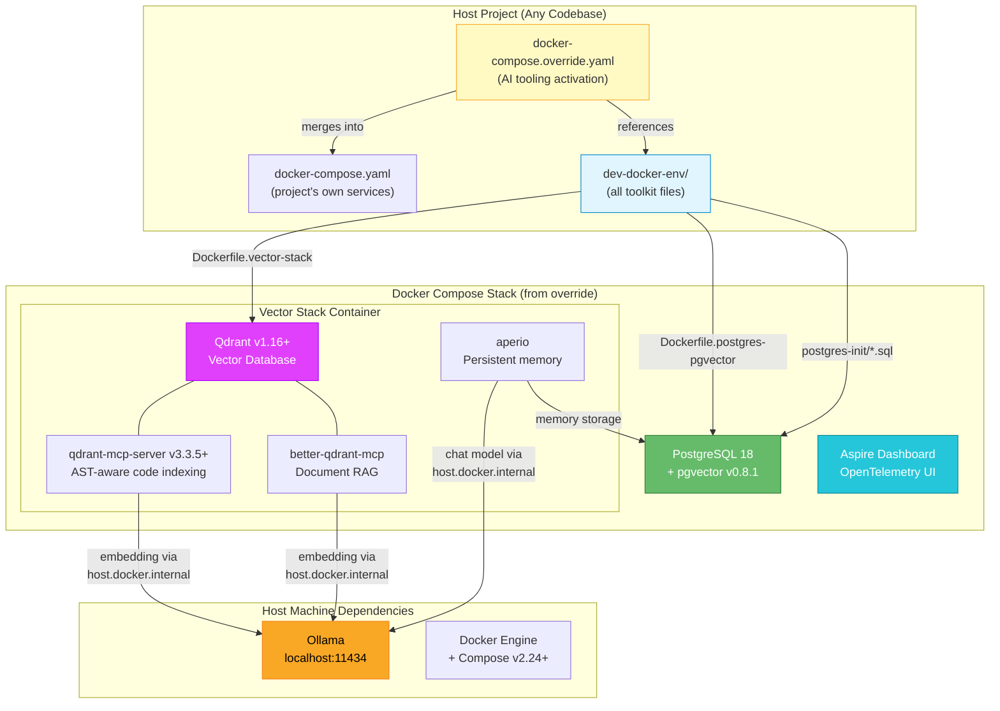

### 4.2 Data Flow Architecture

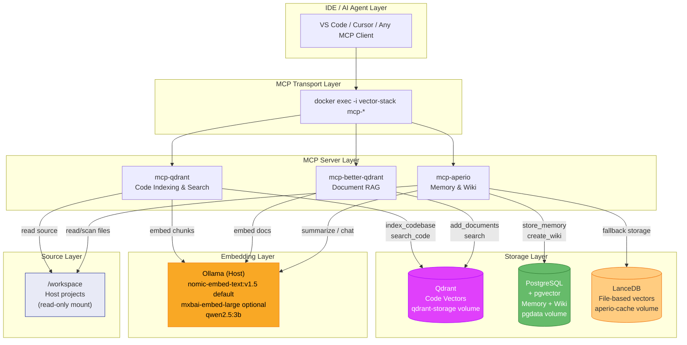

### 4.3 Container Relationship Map

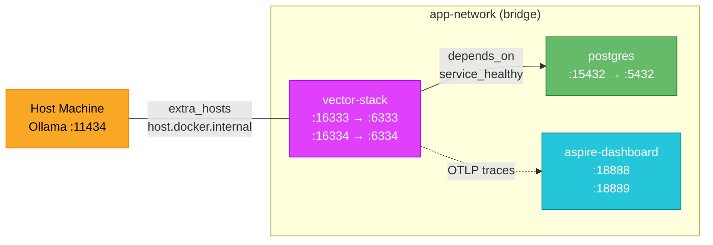

---

## 5. Component Deep-Dives

### 5.1 Vector-Stack Container

The **centrepiece** of the toolkit. A single container housing Qdrant and three MCP servers.

**Why a single container?**

| Alternative | Drawback |
| :--- | :--- |
| Separate container per MCP server | Adds 3 containers, each needing network config to reach Qdrant; increases `docker exec` targets |
| MCP servers as persistent daemons | Wastes CPU/RAM when idle; complicates lifecycle management |
| MCP servers on host | Defeats the purpose of dockerisation; requires Node.js on host |

**Current design:** One container with Qdrant as the persistent process and MCP servers invoked on-demand via `docker exec -i vector-stack mcp-<name>`. This yields:

- Zero overhead when MCP servers are not being queried
- Shared loopback (`127.0.0.1:6333`) between Qdrant and all MCP servers
- Single container to manage, restart, and monitor

**Base Image:** `qdrant/qdrant:v1.16.3` (Debian 13 trixie) — chosen because Qdrant is the primary persistent process, and adding Node.js to a Debian-based Qdrant image is simpler than adding Qdrant to a Node.js image.

**Installed Software:**

| Component | Version | Purpose | Source |
| :--- | :--- | :--- | :--- |
| Qdrant | v1.16.3+ | Vector database engine | Base image |
| Node.js | 20 | MCP server runtime | Debian apt repos |
| qdrant-mcp-server | v3.3.5+ | AST-aware code indexing | [mhalder/qdrant-mcp-server](https://github.com/mhalder/qdrant-mcp-server) |
| better-qdrant-mcp-server | ^0.1.1 | General document RAG | [npm](https://www.npmjs.com/package/better-qdrant-mcp-server) |
| aperio | v0.50.1+ | Persistent AI memory | [baiganio/aperio](https://github.com/baiganio/aperio) |

### 5.2 PostgreSQL + pgvector Container

**Purpose:** Dual-role database providing:

1. **Aperio memory storage** — `memories`, `wiki_articles`, `wiki_article_revisions`, `wiki_article_sources`, `schema_migrations` tables
2. **pgvector extension** — Vector similarity search capability within PostgreSQL for Aperio's embedding needs

**Image:** `postgres:18-alpine` with pgvector v0.8.1 added via Alpine APK.

> [!WARNING]
> pgvector v0.8.0 does **not** compile against PostgreSQL 18 due to a `vacuum_delay_point()` API change. The Alpine APK ships v0.8.1 which includes the fix. This constraint must be maintained when upgrading PostgreSQL versions.

**Init Script (`01-aperio.sql`):** Automatically runs on first start when the data volume is empty. Creates the `aperio` role/database and enables `vector` and `pgcrypto` extensions.

### 5.3 Aspire Dashboard

**What it is:** The [.NET Aspire Dashboard](https://learn.microsoft.com/en-us/dotnet/aspire/fundamentals/dashboard/standalone) is a **language-agnostic** OpenTelemetry visualisation tool. Despite being part of the .NET ecosystem, it receives standard OTLP data from any instrumented application (Node.js, Python, Go, Java, Rust).

**Capabilities:**

| Feature | Description |
| :--- | :--- |
| Distributed Traces | Visualise request flow across services |
| Structured Logs | Filter and search logs from all services |
| Metrics | Real-time dashboards for custom metrics |
| Service Map | Auto-discovered topology of connected services |

**Port Mapping:**

| Host Port | Container Port | Protocol | Purpose |
| :--- | :--- | :--- | :--- |
| 18888 | 18888 | HTTP | Web UI |
| 18889 | 18889 | gRPC | OTLP receiver |

**Integration:** Any service sends telemetry by setting:
```
OTEL_EXPORTER_OTLP_ENDPOINT=http://aspire-dashboard:18889
OTEL_SERVICE_NAME=<service-name>
```

### 5.4 Ollama (Host Dependency)

Ollama runs on the **host machine**, not inside Docker. This is intentional:

- Embedding models are large (274 MB – 7.5 GB) and should not be baked into container images
- GPU passthrough to Docker adds complexity and platform-specific configuration
- A single Ollama instance can serve multiple projects and containers simultaneously

**Required Models:**

| Model | Size | Params | Dims | Context | Purpose |
| :--- | :--- | :--- | :--- | :--- | :--- |
| `nomic-embed-text:v1.5` | 274 MB | 137M | 768 | 8,192 | Code and document embeddings |
| `mxbai-embed-large` | ~670 MB | 335M | 1,024 | 512 | Optional higher-quality embeddings; requires separate collection and stricter chunking |
| `qwen2.5:3b` | 1.9 GB | 3B | — | 32K | Aperio chat/summarisation |

**Connectivity from containers:**

```yaml
extra_hosts:
  - "host.docker.internal:${OLLAMA_HOST_IP:-host-gateway}"
```

- **Standard Docker Engine (Linux/macOS/Windows):** `host-gateway` resolves correctly — no configuration needed
- **Rancher Desktop / Lima VMs:** Set `OLLAMA_HOST_IP=<LAN-IP>` in `.env` file to bypass VM networking

> [!TIP]
> Find your LAN IP: `ip route get 1.1.1.1 | awk '{print $7; exit}'`
> Verify Ollama is reachable: `curl http://<ip>:11434/api/tags`

---

## 6. MCP Server Ecosystem

### 6.1 Server Comparison Matrix

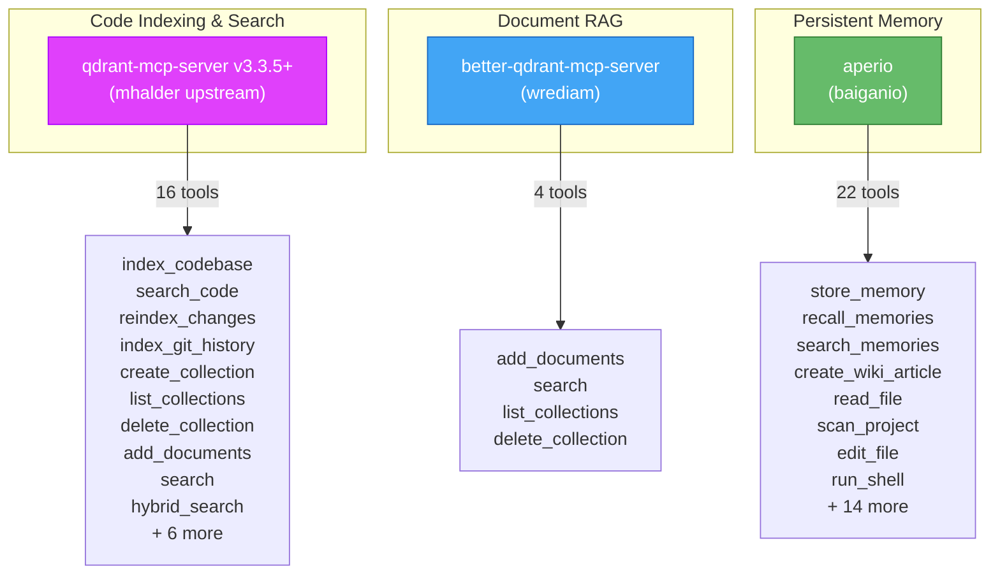

### 6.2 Detailed Tool Inventory

#### qdrant-mcp-server (Primary — Code Intelligence)

| Tool | Description | Key Parameters |
| :--- | :--- | :--- |
| `index_codebase` | AST-aware indexing via tree-sitter (35+ languages) | `path`, `collection_name` |
| `search_code` | Natural language semantic code search | `query`, `collection_name`, `top_k` |
| `reindex_changes` | Incremental re-indexing of changed files | `path`, `collection_name` |
| `index_git_history` | Index git commit messages and diffs | `path`, `depth` |
| `create_collection` | Create a new Qdrant collection | `name`, `vector_size` |
| `list_collections` | List all collections | — |
| `delete_collection` | Delete a collection | `name` |
| `add_documents` | Add arbitrary documents | `collection`, `documents` |
| `search` | Semantic search in any collection | `query`, `collection`, `top_k` |
| `hybrid_search` | Combined vector + keyword search | `query`, `collection`, `filter` |

> [!IMPORTANT]
> Upstream `mhalder/qdrant-mcp-server` v3.3.5 includes the two fixes from PR #60:
> 1. `checkCompatibility: false` — prevents version mismatch failures against self-hosted Qdrant v1.16/v1.17
> 2. 3800-char input truncation — prevents Ollama context overflow and silent batch drops
>
> The earlier `lemyskaman/qdrant-mcp-server` `copilot-compatibility` fork was the source of those fixes, but the current recommendation is to pin upstream v3.3.5+ instead of carrying a fork.

#### better-qdrant-mcp-server (Secondary — Document Operations)

| Tool | Description |
| :--- | :--- |
| `add_documents` | Store arbitrary text with metadata in Qdrant |
| `search` | Semantic search across stored documents |
| `list_collections` | List available collections |
| `delete_collection` | Remove a collection |

#### aperio (Persistent Memory)

Aperio provides a rich set of tools for long-term AI memory:

| Category | Tools |
| :--- | :--- |
| Memory | `store_memory`, `recall_memories`, `search_memories`, `forget_memory` |
| Wiki | `create_wiki_article`, `update_wiki_article`, `search_wiki`, `get_wiki_article` |
| Filesystem | `read_file`, `scan_project`, `edit_file` |
| Shell | `run_shell` |
| Analysis | `analyze_image`, `summarize_conversation` |

### 6.3 Environment Variable Isolation

Each MCP server requires conflicting environment variables. This is resolved via wrapper scripts at `/usr/local/bin/mcp-*`:

| Variable | `mcp-qdrant` | `mcp-better-qdrant` | `mcp-aperio` |
| :--- | :--- | :--- | :--- |
| `EMBEDDING_PROVIDER` | `ollama` | _(different var name)_ | `transformers` |
| `EMBEDDING_BASE_URL` | `http://host.docker.internal:11434` | _(different var name)_ | — |
| `DEFAULT_EMBEDDING_SERVICE` | — | `ollama` | — |
| `OLLAMA_ENDPOINT` | — | `http://host.docker.internal:11434` | — |
| `EMBEDDING_MODEL` | `nomic-embed-text:v1.5` default; `mxbai-embed-large` optional | — | — |
| `OLLAMA_MODEL` | — | `nomic-embed-text:v1.5` default; `mxbai-embed-large` optional | `qwen2.5:3b` |
| `OLLAMA_BASE_URL` | — | — | `http://host.docker.internal:11434` |
| `CODE_CHUNK_SIZE` | `1500` | — | — |

Each wrapper script sets **only** its own variables and then `exec`s the Node.js process. Variables set at the Docker Compose level (`QDRANT_URL`, `AI_PROVIDER`) are shared by all.

### 6.4 MCP Client Configuration

AI clients connect to the MCP servers using `docker exec` transport:

```json
{
  "servers": {
    "qdrant": {
      "type": "stdio",
      "command": "docker",
      "args": ["exec", "-i", "vector-stack", "mcp-qdrant"]
    },
    "better-qdrant": {
      "type": "stdio",
      "command": "docker",
      "args": ["exec", "-i", "vector-stack", "mcp-better-qdrant"]
    },
    "aperio": {
      "type": "stdio",
      "command": "docker",
      "args": ["exec", "-i", "vector-stack", "mcp-aperio"]
    }
  }
}
```

This configuration goes into:
- **VS Code:** `.vscode/mcp.json` (project-level) or `~/.config/Code/User/mcp.json` (user-level)
- **Claude Code:** `.mcp/config.json` or `~/.claude/mcp/config.json`
- **Cursor:** `.cursor/mcp.json`

---

## 7. Vector Database Strategy

### 7.1 Three-Database Architecture

This toolkit uses **three vector storage backends** for different workloads:

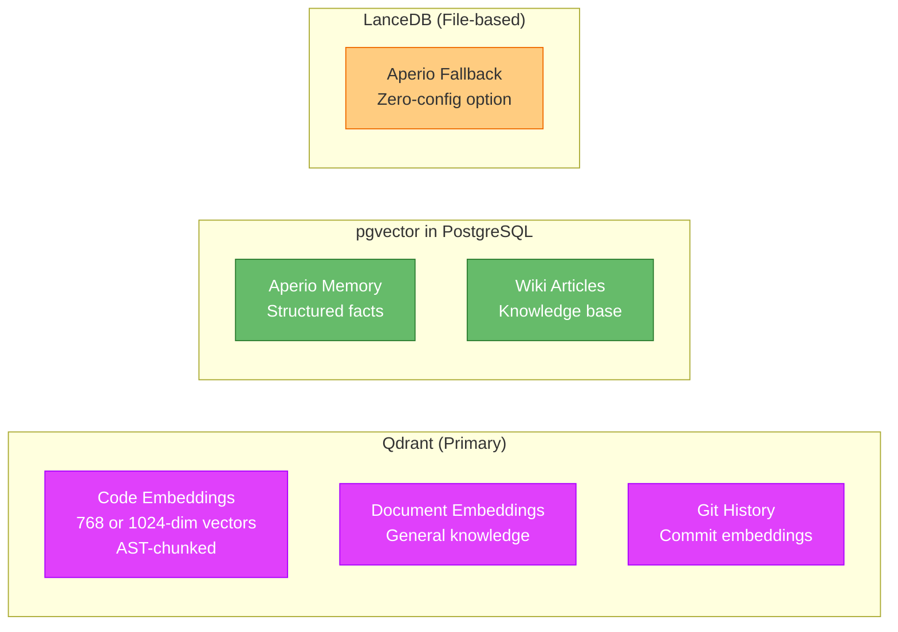

### 7.2 Comparison: When to Use Which

| Criteria | Qdrant | pgvector | LanceDB |
| :--- | :--- | :--- | :--- |
| **Type** | Dedicated vector DB (Rust) | PostgreSQL extension | Embedded (file-based) |
| **Best for** | High-performance vector search at scale | Relational + vector queries together | Zero-ops, local-first, edge |
| **Architecture** | Client-server (REST/gRPC) | SQL queries within PostgreSQL | In-process library |
| **Scaling** | Horizontal (sharding) | Vertical (PostgreSQL scaling) | Object storage (S3/GCS) |
| **Sweet spot** | Millions+ vectors | <50M vectors | Prototyping, CLI tools |
| **ACID** | No | Yes (full PostgreSQL ACID) | No |
| **Ops burden** | Medium (separate service) | Low (if PG already exists) | Zero (no server) |
| **Search quality** | Excellent (purpose-built HNSW) | Good (HNSW since v0.5.0) | Good (IVF_PQ + DiskANN) |

### 7.3 Role Assignment in This Toolkit

| Database | Role | Justification |
| :--- | :--- | :--- |
| **Qdrant** | Primary code vector storage | Purpose-built for high-throughput similarity search; optimised filtering; battle-tested with MCP servers |
| **pgvector** | Aperio structured memory | Aperio needs relational tables (memories, wiki articles) + vector search in the same database; ACID transactions for memory consistency |
| **LanceDB** | Aperio zero-config fallback | When `DB_BACKEND` is not set to `postgres`, Aperio auto-detects and uses LanceDB (file-based, zero-config); useful for getting started without PostgreSQL |

---

## 8. Embedding Models & Strategies

### 8.1 Model Selection

| Model | Params | Size | Dims | Context | CodeSearchNet Avg / MTEB | Recommendation |
| :--- | :--- | :--- | :--- | :--- | :--- | :--- |
| `nomic-embed-text:v1.5` | 137M | 274 MB | 768 | 8,192 | ~76% CodeSearchNet proxy / 62.28 MTEB English v1 | **Default choice** — excellent balance of quality, speed, context length, and resource usage |
| `nomic-embed-code` | 7B | 7.5 GB | 4,096 | 32,768 | ~81% | Optional upgrade for code-heavy workloads; requires GPU |
| `mxbai-embed-large` | 335M | ~670 MB | 1,024 | 512 | 64.68 MTEB English v1 | Candidate alternative — higher English MTEB, but larger, slower, and much shorter context |
| `qwen3-embedding` | 0.6B–8B | Varies | Varies | 40K | SOTA on MTEB | Future consideration for multilingual codebases |

**Why `nomic-embed-text:v1.5` is the default:**

1. **Real-world code retrieval is excellent:** SourcePrep benchmark showed 84.6% R@1 vs nomic-embed-code's 82.1% R@1 on practical code queries
2. **Resource efficient:** 274 MB coexists with any main LLM; the 7B code model competes for GPU memory
3. **Universal support:** `qdrant-mcp-server` and `better-qdrant-mcp-server` default to it without configuration; Aperio uses its own ONNX embedding path unless separately configured
4. **8K context is sufficient:** Most code functions/classes fit within 2K tokens
5. **Validated path:** `qdrant-mcp-server` v3.3.5 was fixed and tested with `nomic-embed-text:v1.5` against Ollama v0.20.7

### 8.1.1 `mxbai-embed-large` vs `nomic-embed-text:v1.5`

`mxbai-embed-large` is a reasonable alternative to evaluate if retrieval quality matters more than local resource usage. It is not the default for this toolkit yet because it trades away the main operational advantages of `nomic-embed-text:v1.5`.

| Decision Factor | `nomic-embed-text:v1.5` | `mxbai-embed-large` | Recommendation |
| :--- | :--- | :--- | :--- |
| Embedding dimensions | 768 | 1,024 | Existing Qdrant collections must match the model dimension; changing models requires a new collection or reindex |
| Download size | 274 MB | ~670 MB | Nomic remains better for low-resource machines |
| Reported quality | ~62.28 MTEB English v1 | ~64.68 MTEB English v1 | mxbai has a modest benchmark advantage |
| Context window | 8,192 tokens | 512 tokens | Nomic is safer for longer code chunks and mixed text/code documents |
| Speed/memory | Smaller and faster on CPU | Larger and slower | Nomic is preferable for always-on local development |
| Compatibility | Already validated with qdrant-mcp-server v3.3.5 | Needs explicit validation across qdrant-mcp-server, better-qdrant-mcp-server, and existing indexes | Keep nomic as default; test mxbai in a separate collection |

**Adoption guidance:**

- Keep `nomic-embed-text:v1.5` as the default until a side-by-side retrieval benchmark proves that `mxbai-embed-large` improves developer outcomes for this project.
- If testing `mxbai-embed-large`, create a separate Qdrant collection and do not reuse existing `nomic` indexes because dimensions and vector values are incompatible.
- Use stricter chunking for mxbai during evaluation, for example `CODE_CHUNK_SIZE=1000–1200`, because its 512-token context is much smaller than nomic's 8K context.
- Remember that Aperio's internal ONNX embedding path already uses an mxbai-style model; changing `EMBEDDING_MODEL` for `qdrant-mcp-server` only affects Qdrant code/document indexes unless Aperio's own embedding configuration is changed.

### 8.2 Code Chunking Strategy

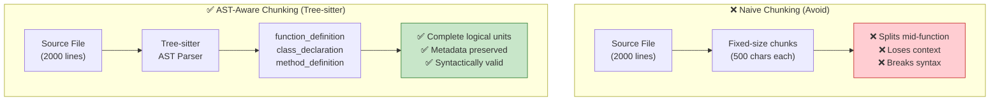

**Best Practices:**

| Practice | Description |
| :--- | :--- |
| **AST boundaries** | Chunk at function/class/method boundaries using Tree-sitter |
| **Max chunk size** | 1500 characters for `nomic-embed-text:v1.5`; use 1000–1200 characters when evaluating `mxbai-embed-large` because of its 512-token context |
| **Metadata enrichment** | Attach file path, language, class name, imports to each chunk |
| **Parent-child indexing** | Store small child chunks (single function) linked to larger parent chunks (full class) for context expansion |
| **Incremental re-indexing** | Only re-index files that changed (via git diff or file hash) |
| **Hybrid search** | Combine vector similarity (semantic intent) with BM25 keyword matching (exact symbol names) |

### 8.3 Embedding Pipeline

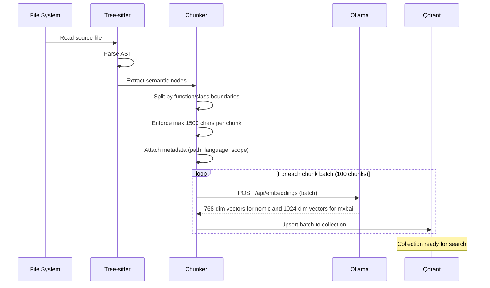

---

## 9. Observability Layer

### 9.1 Aspire Dashboard Integration

The Aspire Dashboard provides a **unified observability view** for all services in the stack:

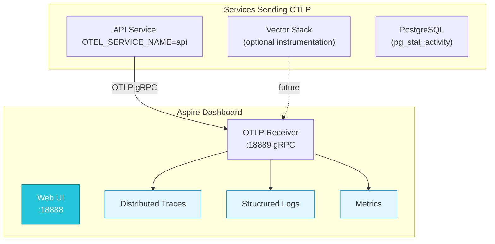

### 9.2 Configuration

```yaml
aspire-dashboard:
  image: mcr.microsoft.com/dotnet/aspire-dashboard:latest
  ports:
    - "18888:18888"  # Web UI
    - "18889:18889"  # OTLP gRPC receiver
  environment:
    ASPIRE_DASHBOARD_UNSECURED_ALLOW_ANONYMOUS: "true"
    DOTNET_DASHBOARD_UNSECURED_ALLOW_ANONYMOUS: "true"
    Dashboard__Frontend__AuthMode: Unsecured
  networks:
    - app-network
  restart: unless-stopped
```

Services export telemetry by setting:
```
OTEL_EXPORTER_OTLP_ENDPOINT=http://aspire-dashboard:18889
OTEL_SERVICE_NAME=<service-name>
OTEL_LOGS_EXPORTER=otlp
```

---

## 10. File & Directory Structure Plan

All toolkit files reside inside `dev-docker-env/` at the project root. Only two files live at the root: `README.md` and `docker-compose.override.yaml`.

```
project-root/
├── docker-compose.override.yaml          ← Activates the AI tooling stack
├── README.md                              ← Full setup instructions (created last)
│
├── dev-docker-env/                        ← ALL toolkit files
│   ├── dockerfiles/
│   │   ├── Dockerfile.vector-stack        ← Qdrant + 3 MCP servers
│   │   └── Dockerfile.postgres-pgvector   ← PostgreSQL 18 + pgvector v0.8.1
│   │
│   ├── scripts/
│   │   ├── vector-stack-entrypoint.sh     ← Custom entrypoint for vector-stack
│   │   ├── ai-stack.sh                    ← CLI: status, reset, reindex
│   │   └── start.sh                       ← One-command full stack launch
│   │
│   ├── config/
│   │   ├── postgres-init/
│   │   │   └── 01-aperio.sql              ← Aperio DB/role/extension init
│   │   ├── mcp/
│   │   │   ├── mcp-config.vscode.json     ← Template for .vscode/mcp.json
│   │   │   ├── mcp-config.claude.json     ← Template for .mcp/config.json
│   │   │   └── mcp-config.cursor.json     ← Template for .cursor/mcp.json
│   │   └── env/
│   │       └── .env.example               ← Template environment variables
│   │
│   └── docs/
│       └── ARCHITECTURE.md                ← Design rationale (this report's companion)
│
└── docs/
    └── research-report-ai-dev-tooling-stack.md  ← THIS DOCUMENT
```

---

## 11. Docker Compose Override Pattern

### 11.1 How Override Files Work

Docker Compose automatically merges `docker-compose.override.yaml` with `docker-compose.yaml`:

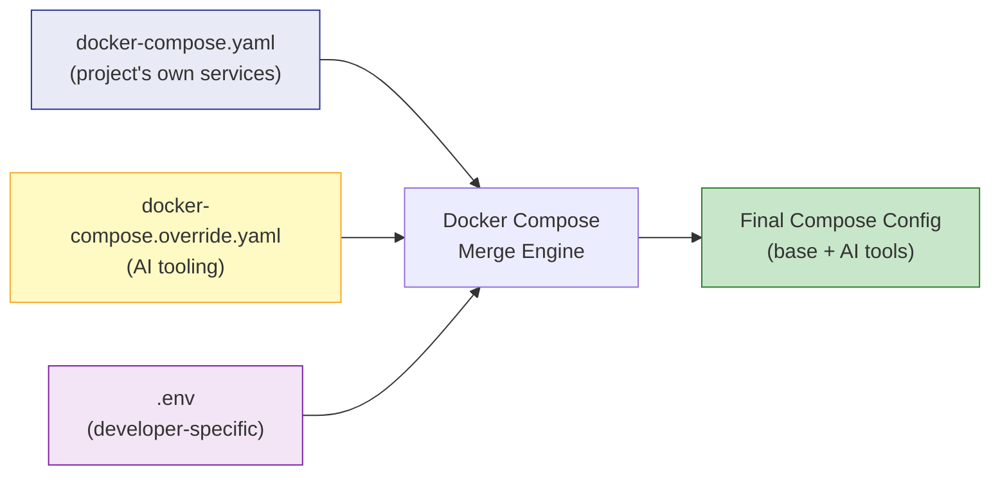

**Key advantage:** The host project's `docker-compose.yaml` is **never modified**. The AI tooling is a pure additive overlay.

### 11.2 Override Structure

The override file defines three new services and their supporting infrastructure:

```yaml
# docker-compose.override.yaml (simplified)
services:
  postgres:
    build:
      context: ./dev-docker-env
      dockerfile: dockerfiles/Dockerfile.postgres-pgvector
    ports:
      - "15432:5432"
    volumes:
      - pgdata:/var/lib/postgresql
      - ./dev-docker-env/config/postgres-init:/docker-entrypoint-initdb.d:ro
    healthcheck:
      test: [CMD-SHELL, pg_isready -U postgres]

  vector-stack:
    container_name: vector-stack
    build:
      context: ./dev-docker-env
      dockerfile: dockerfiles/Dockerfile.vector-stack
    extra_hosts:
      - "host.docker.internal:${OLLAMA_HOST_IP:-host-gateway}"
    ports:
      - "16333:6333"
      - "16334:6334"
    volumes:
      - qdrant-storage:/qdrant/storage
      - aperio-cache:/root/.cache/aperio
      - ${HOME}/projects:/workspace:ro
    depends_on:
      postgres:
        condition: service_healthy

  aspire-dashboard:
    image: mcr.microsoft.com/dotnet/aspire-dashboard:latest
    ports:
      - "18888:18888"
      - "18889:18889"

volumes:
  pgdata:
    external: true
  qdrant-storage:
    external: true
  aperio-cache:
    external: true
```

### 11.3 Generalisation Challenge

The example project's override is **project-specific** — it references project services (`api`, `flyway-public`, `vpn`) that won't exist in other projects. The generalised version must:

1. Only add the three AI infrastructure services (postgres, vector-stack, aspire-dashboard)
2. Not reference any project-specific services
3. Work with or without an existing `docker-compose.yaml` in the host project
4. Define its own `app-network` if the host project doesn't have one

---

## 12. Networking & Connectivity

### 12.1 Network Topology

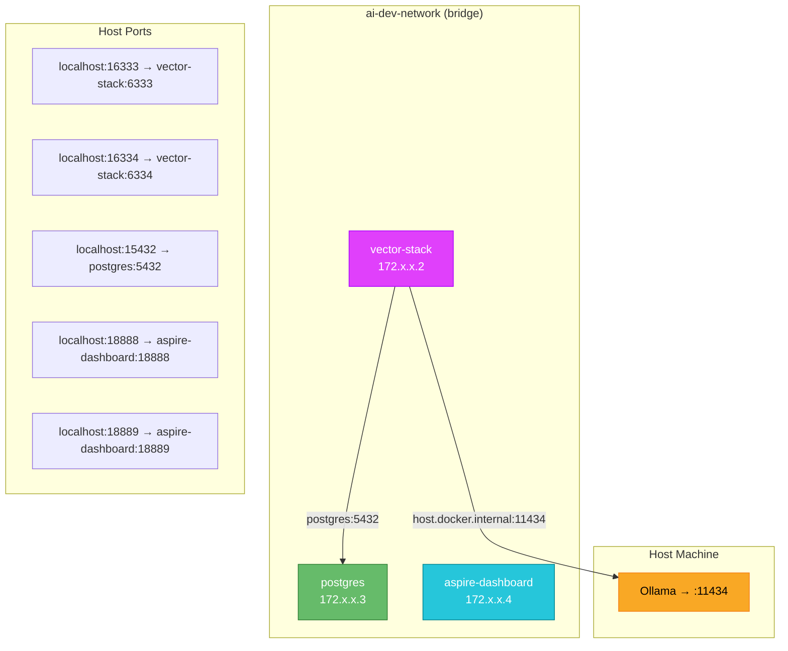

### 12.2 Port Mapping Summary

| Host Port | Container Port | Service | Protocol | Purpose |
| :--- | :--- | :--- | :--- | :--- |
| 15432 | 5432 | postgres | TCP | PostgreSQL client connections |
| 16333 | 6333 | vector-stack | HTTP | Qdrant REST API |
| 16334 | 6334 | vector-stack | gRPC | Qdrant gRPC API |
| 18888 | 18888 | aspire-dashboard | HTTP | Dashboard web UI |
| 18889 | 18889 | aspire-dashboard | gRPC | OTLP telemetry receiver |

All host ports use an **offset pattern** (+10000 or +1xxxx prefix) to avoid conflicts with services the developer may already have running.

### 12.3 Host Ollama Connectivity

The `host.docker.internal` hostname is used to connect from containers to the host's Ollama:

| Docker Runtime | `host-gateway` Resolution | Override Needed? |
| :--- | :--- | :--- |
| Docker Engine (Linux) | Host bridge IP (172.17.0.1) | No |
| Docker Desktop (macOS/Windows) | Host machine | No |
| Rancher Desktop | Lima VM IP (wrong) | Yes — set `OLLAMA_HOST_IP=<LAN-IP>` |
| Podman | Varies | Possibly — test and override if needed |

---

## 13. Volume & Persistence Strategy

### 13.1 Volume Inventory

| Volume | Service | Contents | Size | Survives `down`? | Survives `down -v`? |
| :--- | :--- | :--- | :--- | :--- | :--- |
| `pgdata` | postgres | All database data (aperio + any project DB) | ~50 MB+ | ✅ (external) | ❌ |
| `qdrant-storage` | vector-stack | Qdrant collections and indexed vectors | ~100 MB+ | ✅ (external) | ❌ |
| `aperio-cache` | vector-stack | ONNX embedding model (~322 MB) + LanceDB data | ~400 MB | ✅ (external) | ❌ |

### 13.2 Why External Volumes

All volumes are declared as `external: true`, meaning they must be created **before** the first `docker compose up`:

```bash
docker volume create pgdata
docker volume create qdrant-storage
docker volume create aperio-cache
```

**Rationale:** `docker compose down` (without `-v`) never deletes external volumes. This prevents accidental data loss when stopping the stack. Only explicit `docker volume rm <name>` deletes the data.

### 13.3 Workspace Mount

```yaml
volumes:
  - ${HOME}/projects:/workspace:ro
```

The host's projects directory is mounted read-only at `/workspace` inside the vector-stack container. This gives:

- **aperio:** Access to read and scan project files for its `read_file` and `scan_project` tools
- **qdrant-mcp-server:** Access to source files for `index_codebase`

The `:ro` flag prevents any MCP server from accidentally modifying source files.

---

## 14. Extensibility & Growth Path

### 14.1 Adding New MCP Servers

The architecture is designed for growth. Adding a new MCP server requires:

1. **Add installation to `Dockerfile.vector-stack`** — Clone/install the new server
2. **Create a wrapper script** at `/usr/local/bin/mcp-<name>` — Set server-specific env vars
3. **Update MCP client config** — Add a new `docker exec` entry

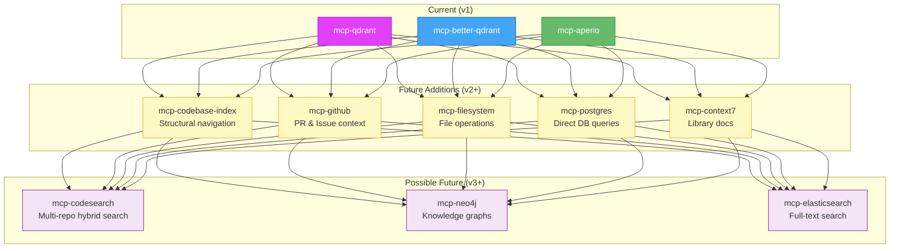

### 14.2 Multi-Project Support

The same Docker Compose stack can serve multiple projects simultaneously:

- **Qdrant:** Each project gets its own collection (e.g., `code_<hash>`)
- **Aperio:** Memory and wiki are per-conversation, not per-project
- **Workspace mount:** `${HOME}/projects:/workspace:ro` gives access to all projects under `~/projects/`

### 14.3 Optional GPU Acceleration

For developers with NVIDIA GPUs, future versions could add:

```yaml
vector-stack:
  deploy:
    resources:
      reservations:
        devices:
          - driver: nvidia
            count: 1
            capabilities: [gpu]
```

This would enable GPU-accelerated embedding generation inside the container, removing the dependency on host-installed Ollama.

---

## 15. Implementation Plan

### 15.1 Phased Implementation

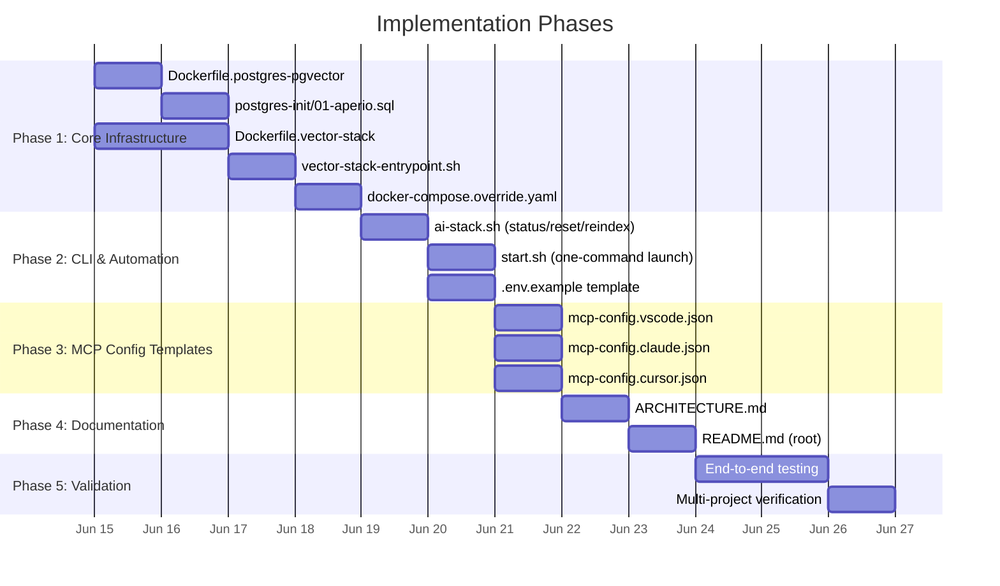

### 15.2 Detailed Task Breakdown

#### Phase 1: Core Infrastructure Files

| Task | File | Description |
| :--- | :--- | :--- |
| 1.1 | `dev-docker-env/dockerfiles/Dockerfile.postgres-pgvector` | PostgreSQL 18 Alpine + pgvector v0.8.1 via APK copy method |
| 1.2 | `dev-docker-env/config/postgres-init/01-aperio.sql` | Create aperio role, database, enable `vector` and `pgcrypto` extensions |
| 1.3 | `dev-docker-env/dockerfiles/Dockerfile.vector-stack` | Qdrant v1.16+ base, Node.js 20, clone & build 3 MCP servers, create wrapper scripts, custom entrypoint |
| 1.4 | `dev-docker-env/scripts/vector-stack-entrypoint.sh` | Start Qdrant in background, health-poll, wait on PID |
| 1.5 | `docker-compose.override.yaml` | Define postgres, vector-stack, aspire-dashboard services with external volumes and networking |

#### Phase 2: CLI & Automation

| Task | File | Description |
| :--- | :--- | :--- |
| 2.1 | `dev-docker-env/scripts/ai-stack.sh` | Management CLI: `status` (health + collections), `reset` (soft/hard/memory), `reindex <path>` |
| 2.2 | `dev-docker-env/scripts/start.sh` | One-command launcher: volume creation → compose up → optional indexing |
| 2.3 | `dev-docker-env/config/env/.env.example` | Template with `OLLAMA_HOST_IP`, `COMPOSE_PROFILES`, workspace paths |

#### Phase 3: MCP Configuration Templates

| Task | File | Description |
| :--- | :--- | :--- |
| 3.1 | `dev-docker-env/config/mcp/mcp-config.vscode.json` | VS Code MCP template with `docker exec` transport |
| 3.2 | `dev-docker-env/config/mcp/mcp-config.claude.json` | Claude Code / Claude Desktop MCP template |
| 3.3 | `dev-docker-env/config/mcp/mcp-config.cursor.json` | Cursor IDE MCP template |

#### Phase 4: Documentation

| Task | File | Description |
| :--- | :--- | :--- |
| 4.1 | `dev-docker-env/docs/ARCHITECTURE.md` | Design rationale document explaining every choice |
| 4.2 | `README.md` | Full setup guide with prerequisites, quick start, configuration, troubleshooting |

#### Phase 5: Validation

| Task | Description |
| :--- | :--- |
| 5.1 | Clean-room test: clone repo, follow README, verify all services start |
| 5.2 | Test MCP connectivity from VS Code, Claude, and Cursor |
| 5.3 | Test codebase indexing on a real project |
| 5.4 | Test memory persistence across container restarts |
| 5.5 | Test on multiple Docker runtimes (Docker Engine, Docker Desktop, Rancher Desktop) |

---

## 16. Risk Assessment

| Risk | Likelihood | Impact | Mitigation |
| :--- | :--- | :--- | :--- |
| Qdrant JS client version mismatch | Low if pinned | Server fails to start | Use upstream `qdrant-mcp-server` v3.3.5+ with `checkCompatibility: false` |
| Ollama context overflow silently drops chunks | Low if pinned and chunked | Zero documents indexed | Use qdrant-mcp-server v3.3.5+ 3800-char truncation + `CODE_CHUNK_SIZE=1500`; test stricter chunks for mxbai |
| Aperio `logger.warning()` crash | Medium | Server crashes on startup | `sed -i` patch at build time in Dockerfile |
| `host.docker.internal` resolution fails (Rancher/Lima) | Medium | No embedding generation | `OLLAMA_HOST_IP` override in `.env` |
| pgvector version incompatible with PostgreSQL major version | Low | Build fails | Pin both versions; document upgrade path |
| Tree-sitter native compilation fails on Node 24+ | Low | `index_codebase` tool unavailable | Pin Node.js 20 in Dockerfile; document `CXXFLAGS` workaround |
| MCP protocol changes in future AI client versions | Low | Config format changes | Template-based configs; easy to update |
| Docker Compose version too old for `!reset` tag | Medium | Override merge fails | Document minimum Compose v2.24+ requirement; note: `!reset` only needed if overriding existing services |
| External volumes not created before first run | High | Compose up fails | `start.sh` auto-creates volumes; document manual steps |
| ONNX model download fails (network issues) | Low | Aperio embeddings unavailable | `aperio-cache` volume persists download across rebuilds |

---

## 17. Glossary

| Term | Definition |
| :--- | :--- |
| **MCP** | **Model Context Protocol** — An [open standard by Anthropic](https://modelcontextprotocol.io) that provides a universal interface for AI assistants to connect to external data sources and tools. Analogous to "USB for AI". |
| **MCP Server** | A process that implements the MCP specification and exposes tools (functions) that an AI agent can invoke. Communicates via stdio (local) or HTTP (remote). |
| **MCP Client** | The AI assistant side (e.g., VS Code Copilot, Claude, Cursor) that discovers and invokes MCP server tools. |
| **Vector Database** | A database optimised for storing and querying high-dimensional vector embeddings. Enables semantic (meaning-based) search rather than keyword matching. |
| **Embedding** | A fixed-length numeric vector (e.g., 768 floats) that represents the semantic meaning of a piece of text or code. Similar meanings produce similar vectors. |
| **Qdrant** | A purpose-built [vector database](https://qdrant.tech/) written in Rust. Provides REST and gRPC APIs for storing, searching, and filtering vectors. |
| **pgvector** | A [PostgreSQL extension](https://github.com/pgvector/pgvector) that adds vector similarity search capabilities (HNSW indexing, cosine/L2/inner product distance) directly within PostgreSQL. |
| **LanceDB** | An [embedded vector database](https://lancedb.com/) that stores data in the Lance columnar format. No server needed — runs in-process. |
| **Ollama** | A [local LLM runner](https://ollama.com/) that makes it easy to download and serve open-source language models and embedding models on a developer's machine. |
| **nomic-embed-text** | A [137M parameter embedding model](https://ollama.com/library/nomic-embed-text) by Nomic AI. Produces 768-dimensional vectors with an 8K token context window. Excellent for general-purpose and code embeddings. |
| **mxbai-embed-large** | A [335M parameter embedding model](https://ollama.com/library/mxbai-embed-large) by Mixedbread AI. Produces 1024-dimensional vectors with a 512-token context window. Useful as a quality-focused alternative to `nomic-embed-text`, but requires stricter chunking and separate vector collections. |
| **Tree-sitter** | A [parser generator tool](https://tree-sitter.github.io/tree-sitter/) that builds concrete syntax trees for source code. Enables AST-aware chunking where code is split at semantic boundaries (function/class definitions) rather than arbitrary character positions. |
| **AST** | **Abstract Syntax Tree** — A tree representation of the syntactic structure of source code. Used by tree-sitter to understand code boundaries. |
| **RAG** | **Retrieval-Augmented Generation** — A technique where relevant documents are retrieved from a database and provided as context to an LLM, improving the quality and accuracy of generated responses. |
| **HNSW** | **Hierarchical Navigable Small World** — An algorithm for approximate nearest neighbour search in high-dimensional spaces. Used by Qdrant and pgvector for fast vector similarity search. |
| **OTLP** | **OpenTelemetry Protocol** — The standard wire protocol for transmitting telemetry data (traces, metrics, logs) between services and observability backends. |
| **Aspire Dashboard** | A [standalone observability tool](https://learn.microsoft.com/en-us/dotnet/aspire/fundamentals/dashboard/standalone) by Microsoft that visualises OpenTelemetry data. Language-agnostic despite being part of the .NET Aspire ecosystem. |
| **Aperio** | An MCP server by [baiganio](https://github.com/baiganio/aperio) that provides persistent AI memory (facts, wiki articles, file operations) backed by PostgreSQL+pgvector or LanceDB. |
| **Docker Compose Override** | A `docker-compose.override.yaml` file that Docker Compose [automatically merges](https://docs.docker.com/compose/how-tos/multiple-compose-files/merge/) with the base `docker-compose.yaml`. Used to add development-only services without modifying the base file. |
| **External Volume** | A Docker named volume declared as `external: true`, meaning it must be created manually before use and is never deleted by `docker compose down` (only by explicit `docker volume rm`). |
| **stdio Transport** | The MCP communication mode where the client spawns the server process and communicates via standard input/output streams. Used for local development. |
| **`docker exec` Transport** | A pattern for invoking MCP servers inside a running Docker container: `docker exec -i <container> <mcp-command>`. The IDE spawns `docker exec` as the command, which in turn starts the MCP server process inside the container. |
| **Wrapper Script** | A shell script at `/usr/local/bin/mcp-<name>` inside the vector-stack container that sets server-specific environment variables and then `exec`s the MCP server process. Resolves conflicts between servers that use the same variable names for different values. |

---

## 18. References

### Official Documentation

| Resource | URL |
| :--- | :--- |
| Model Context Protocol Specification | https://modelcontextprotocol.io |
| Qdrant Documentation | https://qdrant.tech/documentation/ |
| pgvector GitHub | https://github.com/pgvector/pgvector |
| LanceDB Documentation | https://lancedb.github.io/lancedb/ |
| Ollama Library | https://ollama.com/library |
| Ollama Embedding API | https://ollama.com/blog/embedding-models |
| Aspire Dashboard (Standalone) | https://learn.microsoft.com/en-us/dotnet/aspire/fundamentals/dashboard/standalone |
| Docker Compose Override Files | https://docs.docker.com/compose/how-tos/multiple-compose-files/merge/ |
| Tree-sitter | https://tree-sitter.github.io/tree-sitter/ |
| OpenTelemetry | https://opentelemetry.io/ |

### MCP Servers

| Server | URL |
| :--- | :--- |
| mhalder/qdrant-mcp-server | https://github.com/mhalder/qdrant-mcp-server |
| qdrant-mcp-server v3.3.5 release | https://github.com/mhalder/qdrant-mcp-server/releases/tag/v3.3.5 |
| qdrant-mcp-server PR #60 | https://github.com/mhalder/qdrant-mcp-server/pull/60 |
| lemyskaman/qdrant-mcp-server (fork) | https://github.com/lemyskaman/qdrant-mcp-server |
| wrediam/better-qdrant-mcp-server | https://github.com/wrediam/better-qdrant-mcp-server |
| better-qdrant-mcp-server (npm) | https://www.npmjs.com/package/better-qdrant-mcp-server |
| baiganio/aperio | https://github.com/baiganio/aperio |
| Official Qdrant MCP Server | https://github.com/qdrant/mcp-server-qdrant |
| mcp-codebase-index | https://github.com/nicobailey/code-index-mcp |
| Claude Context MCP (Zilliz) | https://github.com/zilliztech/claude-context |
| OpenMemory (Mem0) | https://mem0.ai |
| AgentMemory MCP | https://github.com/AgentMemory/agentmemory |

### Embedding Models

| Model | URL |
| :--- | :--- |
| nomic-embed-text (Ollama) | https://ollama.com/library/nomic-embed-text |
| nomic-embed-code | https://huggingface.co/nomic-ai/nomic-embed-code-v1.5 |
| mxbai-embed-large (Ollama) | https://ollama.com/library/mxbai-embed-large |
| mxbai-embed-large-v1 (Hugging Face) | https://huggingface.co/mixedbread-ai/mxbai-embed-large-v1 |
| qwen3-embedding | https://ollama.com/library/qwen3-embedding |

### Docker Images

| Image | URL |
| :--- | :--- |
| qdrant/qdrant | https://hub.docker.com/r/qdrant/qdrant |
| postgres (Alpine) | https://hub.docker.com/_/postgres |
| pgvector/pgvector | https://hub.docker.com/r/pgvector/pgvector |
| Aspire Dashboard | https://mcr.microsoft.com/en-us/artifact/mar/dotnet/aspire-dashboard |

### Articles & Guides

| Topic | URL |
| :--- | :--- |
| Code Chunking with Tree-sitter | https://lancedb.com/blog/code-chunking-tree-sitter |
| Code Chunking Best Practices | https://supermemory.ai/blog/code-chunking |
| Qdrant Code Search Demo | https://github.com/qdrant/demo-code-search |
| pgvector vs Qdrant Comparison | https://encore.dev/resources/pgvector-vs-qdrant |
| Docker MCP Best Practices | https://www.docker.com/blog/docker-mcp-catalog/ |
| MCP Security Best Practices | https://thenewstack.io/mcp-best-practices |
| Ollama Docker Connectivity FAQ | https://github.com/ollama/ollama/blob/main/docs/faq.md |

---

*Research completed: June 14, 2026*
*Ready for implementation planning and execution*
